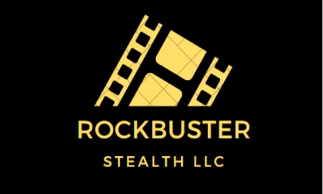

## Rockbuster Stealth: Data-Driven Launch Strategy

Rockbuster Stealth LLC, a former movie rental giant, is pivoting to an online video rental service to compete with streaming platforms like Netflix and Amazon Prime. As a data analyst in the business intelligence department, my role was to analyze Rockbuster's data to inform the launch strategy for the new service. This involves loading data into a relational database, using SQL to analyze it, and presenting insights to the management board.

## Purpose
The purpose of this project is to utilize data analysis to inform the launch strategy of Rockbuster's new online video rental service. By answering key business questions and providing data-driven insights, the project aims to assist in making informed decisions to stay competitive in the market.

## Objective
The objective is to analyze Rockbuster's data to answer specific business questions posed by the management board, such as identifying top revenue-generating movies, understanding customer demographics, and assessing sales variations across geographic regions.

## Data
The project utilizes a dataset containing information on Rockbuster's film inventory, customers, payments, and other relevant metrics. The dataset is loaded into a PostgreSQL database for analysis.

## Tools Used
- PostgreSQL database management system
- SQL for querying and analyzing data
- Visualization tools for presenting insights - tableau.

## Executing the Code
1. PostgreSQL Rockbuster dataset.
2. SQL queries to analyze the data and answer key business questions.
3. Visualizations to present findings in an easily digestible format.
4. Results into a presentation for the Rockbuster management board.

## Resources
- Rockbuster Dataset
- SQL learning materials provided in the project exercises
- Visualization tools for creating charts and graphs. [Link Text](https://public.tableau.com/views/RockbusterStealthUnleashingDataInsightsforStrategicExcellence/Story?:language=en-US&:display_count=n&:origin=viz_share_link)
- Mentor feedback for project evaluation and improvement.
